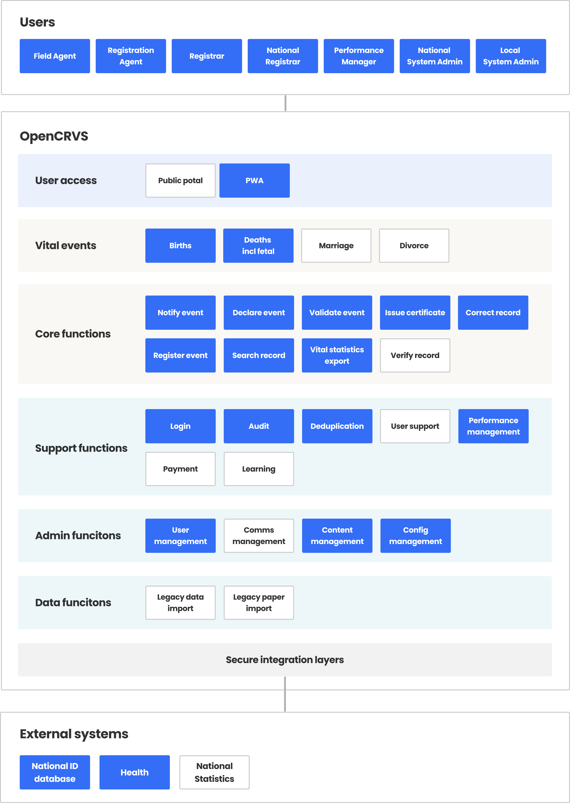

# Functional Architecture

The OpenCRVS functional architecture shows the logical components of which the system is comprised. Each of these "functions" is explained in greater detail within the relevant section of the documentation.&#x20;

#### Key:&#x20;

* Blue (built)
* White (coming soon)
