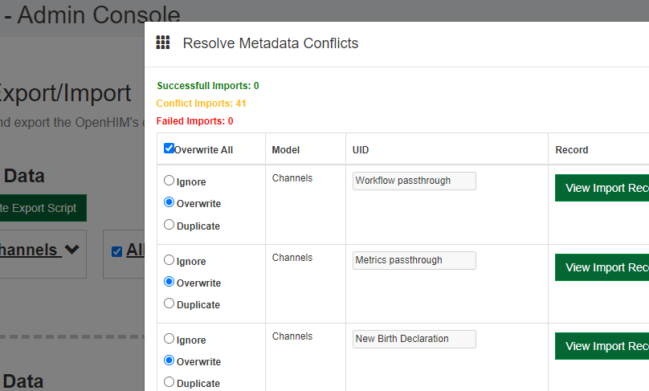

# 3.2.5 Import set up files


Now that your source files are set up you are ready to import them into OpenCRVS.  \
\
Please run all steps from step 1 through to step 14.  If you encounter any errors you must debug your CSV files and start again.  The most likely errors are badly formatted csv source files


1. To begin with, OpenCRVS Core must be running, but it is not necessary for your country configuration server to be running.\
   \
   Ensure that OpenCRVS Core is running following the steps in [**3.1.3 Starting and stopping OpenCRVS**](../3.1-set-up-a-development-environment/3.1.3-starting-and-stopping-opencrvs.md)**.**\

2. Open a new Terminal window when OpenCRVS Core is running and cd inside your country configuration repo directory.  E.G:\
   \
   `cd opencrvs-farajaland`\

3. Ensure that node\_modules are installed by running\
   \
   `yarn --force`
4. To clear any existing data, such as our Farajaland default data run this command inside the country configuration repo directory:\
   \
   `yarn db:clear:all` --path\_to\_core=_\<your local path to the opencrvs-core directory>_\

5. To reset our OpenSource FHIR Enterprise Service Bus: [OpenHIM](http://openhim.org/) to factory defaults, quit and restart OpenCRVS Core following the steps in [**3.1.3 Starting and stopping OpenCRVS.**](../3.1-set-up-a-development-environment/3.1.3-starting-and-stopping-opencrvs.md)\

6. When OpenHIM is running, login [here](http://localhost:8888) - The default username is **root@openhim.org** and the default password is: **openhim-password.**\
   .png>)\

7. When running OpenCRVS locally, login for the first time will fail an SSL certificate security check as we are using self signed certs locally of course, follow the instructions in the error message and click the blue link.\
   \
   .png>)\
   \

8. In the Chrome message click "Advanced", then "Proceed to localhost (unsafe)".  There is nothing to worry about as this is just accepting the locally signed SSL cert.\
   You will see some JSON like this:\
   \
   .png>)\
   \

9. You can now go back to this [link](http://localhost:8888/#!/login), login and set a new password for OpenHIM.  Ensure that you set a strong password using a service such as [1Password](https://1password.com/) .  You **MUST store the OpenHIM password safely** as you will need it to login when monitoring OpenCRVS and when deploying the site to a server in step [**3.3.3 Create Docker Secrets**](../3.3-set-up-a-server-hosted-environment/3.3.3-create-docker-secrets-and-provision-an-sms-gateway.md)...\
   \
   .png>)\
   \

10. Once logged in to OpenHIM click Export/Import then select the OpenCRVS Core file [`infrastructure/openhim-base-config.json`](https://github.com/opencrvs/opencrvs-core/blob/master/infrastructure/openhim-base-config.json) or drag and drop the file into the import box. \
    \
    .png>)\

11. A modal will open displaying the channels that will be imported in a modal titled "Resolve Metadata Conflicts". These are the routing configs for OpenCRVS in OpenHIM. Check the "Overwrite all" checkbox, then scroll to the bottom and click 'Import changes'.\
    \
    \
    \

12. The Page will refresh and you will see this.  OpenHIM is now configured for your country:\
    \
    .png>)\

13. Return to the Terminal window inside your country configuration repo directory \

14. The next step is run once depending on if you are setting up test employees for quality assurance on a local, development or QA environment, or if you are setting up production users for a live environment.  **You cannot switch between a development and production base installation.  To switch from development to production, you must start again from step 1 at the very beginning of this page and create a new import for your needs.**  \
    \
    To populate reference data for your country requirements, by default, you run the `yarn db:populate` command with parameters depending on whether or not you are setting up OpenCRVS with test employees or production employees.  Here is an example import for Farajaland.

```
yarn db:populate \
--password_for_users=<the password your test users can use, ignored in production> \
--environment=<development or production> \
--alpha3_country_code=<your Alpha 3 Country Code> \
--path_to_admin_structure_csv=<path to your country configuration directory>/src/features/administrative/source/<your administrative structure>.csv \
--path_to_crvs_offices_csv=<path to your country configuration directory>/src/features/facilities/source/<your crvs facilities>.csv \
--path_to_health_facilities_csv=<path to your country configuration directory>/src/features/facilities/source/<your health facilities>.csv \
--path_to_employees_csv=<path to your country configuration directory>/src/features/employees/source/<your employees>.csv \
--path_to_statistics_csv=<path to your country configuration directory>/src/features/administrative/source/<your statistics>.csv
```

\
The **--password\_for\_users** parameter will be the password that you wish to set for your test employees in local development only.  Any test users will use this password to login to OpenCRVS.\
\
The **--environment** parameter determines if the users you are about to import are for testing or production.  The parameter is an environment code that must be set to either "development" or "production".\
\
The **--alpha3\_country\_code** must be the Alpha 3 country code in uppercase for your country.  E.G. for Jamaica this would be JAM.  A list of [Alpha 3 country codes are here](https://www.iban.com/country-codes).  We use this parameter to convert your test user mobile phone numbers to an [MSISDN](https://en.wikipedia.org/wiki/MSISDN) number containing the correct country code.

Customise the following parameters depending on the location of the CSV files in your system:

**--path\_to\_admin\_structure\_csv**

**--path\_to\_crvs\_offices\_csv**

**--path\_to\_health\_facilities\_csv**

**--path\_to\_employees\_csv**

**--path\_to\_statistics\_csv**\
\
Therefore for test users in development the command might look like this for Jamaica, where all test users will use the password "rumpunch"\


```
yarn db:populate \
--password_for_users=rumpunch \
--environment=development \
--alpha3_country_code=JAM \
--path_to_admin_structure_csv=<path to your country configuration directory>/src/features/administrative/source/jamaica.csv \
--path_to_crvs_offices_csv=<path to your country configuration directory>/src/features/facilities/source/jamaica-crvs-facilities.csv \
--path_to_health_facilities_csv=<path to your country configuration directory>/src/features/facilities/source/jamaica-health-facilities.csv \
--path_to_employees_csv=<path to your country configuration directory>/src/features/employees/source/jamaica-test-employees.csv \
--path_to_statistics_csv=<path to your country configuration directory>/src/features/administrative/source/jamaica-statistics.csv
```

\
For production users the command might look like this for Jamaica. &#x20;


Dont be concerned that the password "rumpunch" is entered even in production.  You must enter a second parameter, but this test password is ignored and instead strong passwords are automatically generated and displayed to you when the script completes.  **You must copy the production passwords from the console or outputted "login-details.json" and manually distribute them as they are encrypted in the database and you cannot retrieve them later.  DO NOT COMMIT login-details.json to a code repository by mistake!!!!**


```
yarn db:populate \
--password_for_users=rumpunch \
--environment=production \
--alpha3_country_code=JAM \
--path_to_admin_structure_csv=<path to your country configuration directory>/src/features/administrative/source/jamaica.csv \
--path_to_crvs_offices_csv=<path to your country configuration directory>/src/features/facilities/source/jamaica-crvs-facilities.csv \
--path_to_health_facilities_csv=<path to your country configuration directory>/src/features/facilities/source/jamaica-health-facilities.csv \
--path_to_employees_csv=<path to your country configuration directory>/src/features/employees/source/jamaica-production-employees.csv \
--path_to_statistics_csv=<path to your country configuration directory>/src/features/administrative/source/jamaica-statistics.csv
```


**Test users must NEVER be deployed to a production server as they all use the same password and bypass 2FA. You have been warned about this.**


\
Example production password:

```
USERNAME: jonathan.campbell & PASSWORD: subscripted-septicemia-distinguishing-graduate
```

\
The strong passwords are created using [niceware](https://github.com/diracdeltas/niceware) and these usernames and passwords along with contact details for the users are save into a file: "login-details.json" in this [folder](https://github.com/opencrvs/opencrvs-farajaland/master/src/features/employees/generated). \
\
You can then contact the users and tell them their production password which they can change to something else strong and memorable to them when they login\
\
WARNING: The niceware wordlist has not been rigorously checked for offensive words. Use at your own risk. You may need to login as one of these users and change a password if it is deemed offensive.&#x20;

