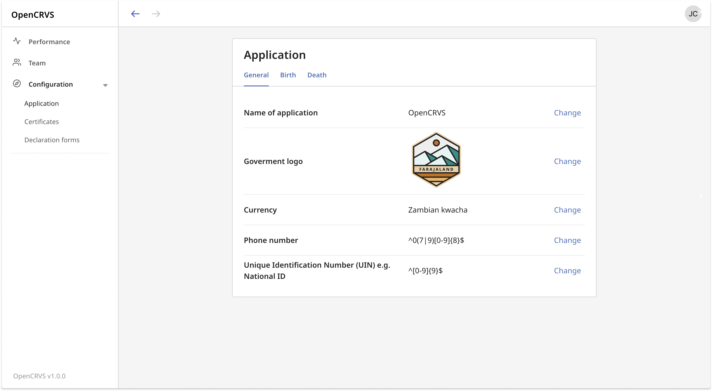

# 4.1 Configure application settings

### Before you start

* Only a National System Admin can configure application settings
* You can make changes to application configuration whenever you like.

### **Steps:**

1. **Change application name**\
   ****This appears on the top left header for all users. We recommend \[Country name] CRVS.\

2. **Upload a logo**\
   ****This is used on the login and declaration review screens\

3. **Set your currency**\
   ****Set the currency for your country. This is used as a label for when fees are required for print a certificate and on the performance dashboard\

4. **Set your mobile number regex**\
   ****This is used to validate phone numbers entered in the declaration form. For guidance please refer to www.regex101.com\

5. **Set your National ID regex**\
   ****This is used to validate national IDs entered in the declaration form. For guidance please refer to www.regex101.com\
