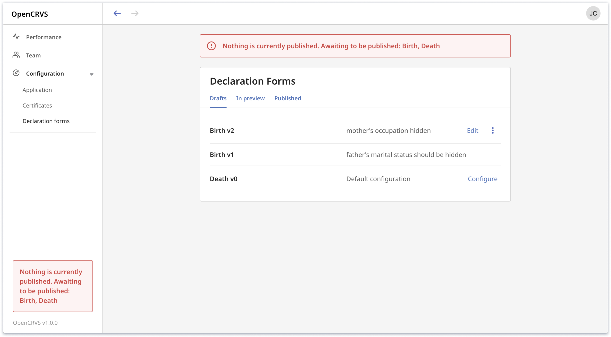

# 4.3 Configure declaration forms

### Before you start

* Only a National System Admin can configure application settings
* Default configuration for birth and death forms are based on UN guidelines
* A set list of questions are required for registration and can not be removed
* You can add any number of custom questions to a page
* Update labels, error messages, placeholders, select options etc following our guidance in section [3.2.6-set-up-multi-language-content.md](../3.-installation/3.2-set-up-your-own-country-configuration/3.2.6-set-up-multi-language-content.md "mention")
* Note the 3 statuses of a declaration form under configuration,  Draft, In Preview and Published.\
  **Draft**: can be edited\
  **In Preview**: available for Field agents, Registration Agents and Registrars so you can test the form\
  **Published**: the declaration form configuration is complete and your OpenCRVS configuration is ready to go live.
* **Once a declaration form has been set to the status 'Published' it can no longer be edited.  NOTE: You will have to start again, clear your database and repeat the processes from** [3.2.5-generate-factory-reset-reference-data-backups.md](../3.-installation/3.2-set-up-your-own-country-configuration/3.2.5-generate-factory-reset-reference-data-backups.md "mention") **to make any changes to a published form.**&#x20;
* You may notice the warning "Nothing is currently published..."  Any test declaration, or event registration made while forms remain unpublished are deleted from the database at the point of publishing. **Do not use OpenCRVS in production with unpublished forms.**

### Steps

1. **Edit a draft (Farajaland default configuration)**\
   ****Click **** 'Configure' to navigate to form configuration\

2. **Set global form settings**\
   ****Click **** the cog ⚙️ button in the top menu. Here you can enable or disable the introduction page in the form (this page is used to help explain your CRVS process to the informant). You can also set the number of addresses required from the informant, parent and deceased. \

3. **Adding a custom question**\
   You can add 4 types of custom text fields. Text field, text area field, phone number and and number field. \
   \
   Select the field you want to add and rename the label. If your configuration has multiple questions you will need to complete the mandatory fields first to save your custom question. \
   \
    (1).png>)\
   \
   Too reorder a question use the arrows. \
   \
   \

4. **Hiding a question**\
   ****To hide a question that is not a mandatory question. Select the question eg. Occupation and toggle the option 'Hide field'. To show and hide hidden questions toggle the option 'Show hidden fields'\
   \
    (1) (1).png>)\

5. **Setting a question to be required for registration**\
   ****To make a question mandatory. Click on the question and toggle the option 'Required for registration' on. This will add a \* to the question make it mandatory to complete and register a declaration.  \
   ****
6. **Save your draft configuration**\
   To save your changes click 'Save'. Add a comment so you can track the changes you have made. A new draft version will be created. \

7. **Preview and testing**\
   To preview your configuration. Click the menu button ••• and select 'Preview'. This will make the declaration form available for Field agents, Registration Agents and Registrars so you can test the form. \

8. **Making further edits**\
   To make additional edits to your declaration form. Navigate to the tab 'Draft' and select 'Edit'.\

9. **Publish your declaration form**\
   Only publish a declaration form when you ready to go live and for OpenCRVS to be used by registration offices. You will not be able to make any future edits. Make sure your latest configuration is 'In Preview'. Then click 'Publish'


Note that for new fields added that you would like to appear on the certificate, you will need to make a note of the content key **before** publishing.


